[火线社区](https://zone.huoxian.cn/d/1103-cve-2022-1162-gitlab)

[CSDN](https://blog.csdn.net/m0_60732362/article/details/124244912?spm=1001.2014.3001.5501)

先知社区

# 漏洞描述

GitLab 是一个用于仓库管理系统的开源项目，使用 Git 作为代码管理工具，可通过 Web 界面访问公开或私人项目。

在GitLab CE/EE版本14.7(14.7.7之前)、14.8(14.8.5之前)和14.9(14.9.2之前)中使用OmniAuth提供商(如OAuth、LDAP、SAML)注册的帐户设置了硬编码密码，允许攻击者潜在地控制帐户。

# 漏洞版本

|  |  | 
| :-----| :----- | 
| Gitlab CE/EE   |  >=14.7,<14.7.7 | 
| Gitlab CE/EE  | >=14.8,<14.8.5 | 
| Gitlab CE/EE      |         >=14.9,<14.9.2 |

# 环境搭建
选择 docker hub 上的 gitlab/gitlab-ce:14.7.4-ce.0 版本
Image Layer Details - gitlab/gitlab-ce:14.7.5-ce.0 | Docker Hub

编写docker-compose 文件，使用docker-compose up -d 搭建 、端口会映射到本地 8080端口、还将映射三个目录。

    version: '3'
    services:
    gitlab:
        image: 'gitlab/gitlab-ce:14.7.4-ce.0'
        container_name: 'gitlab'
        restart: always
        privileged: true
        hostname: 'gitlab'
        environment:
        TZ: 'Asia/Shanghai'
        ports:
        - '8080:80'
        volumes:
        - ./config:/etc/gitlab
        - ./data:/var/opt/gitlab
        - ./logs:/var/log/gitlab

conf目录 下的 gitlab.rb 是配置文件、 initial_root_password 是初始密码文件会，它将会保存24小时。

接下来我们在github 上创建新的  OAuth application 。
  Application name 的名字可以随便写。

    Homepage URL 是gitlab 的 url ，因为本地搭建且端口映射在8080上
    Authorization callback URl 是认证回调url ，用户被 GitHub 重定向的站点

           Homepage 填写 ： http://127.0.0.1:8080
           Callback url 填写 ：http://127.0.0.1:8080/users/auth/github/callback

  但Callback 如果这样填写的话会出一个问题,这个后面再说。

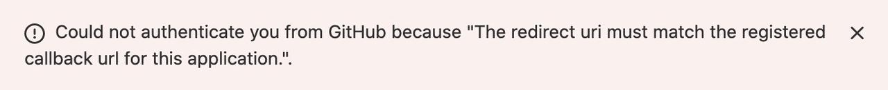
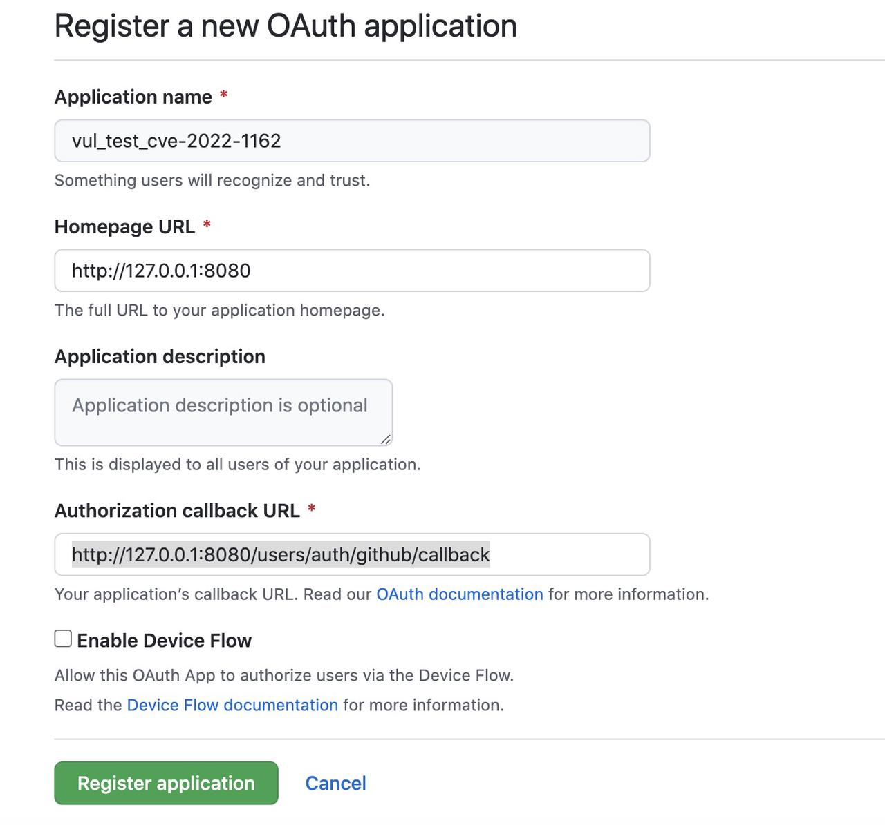

点击 Register application 注册成功 ，会获取到 Client ID 、 Client secrets( 点击 Generate a new client secret 去创建一个新的secret )
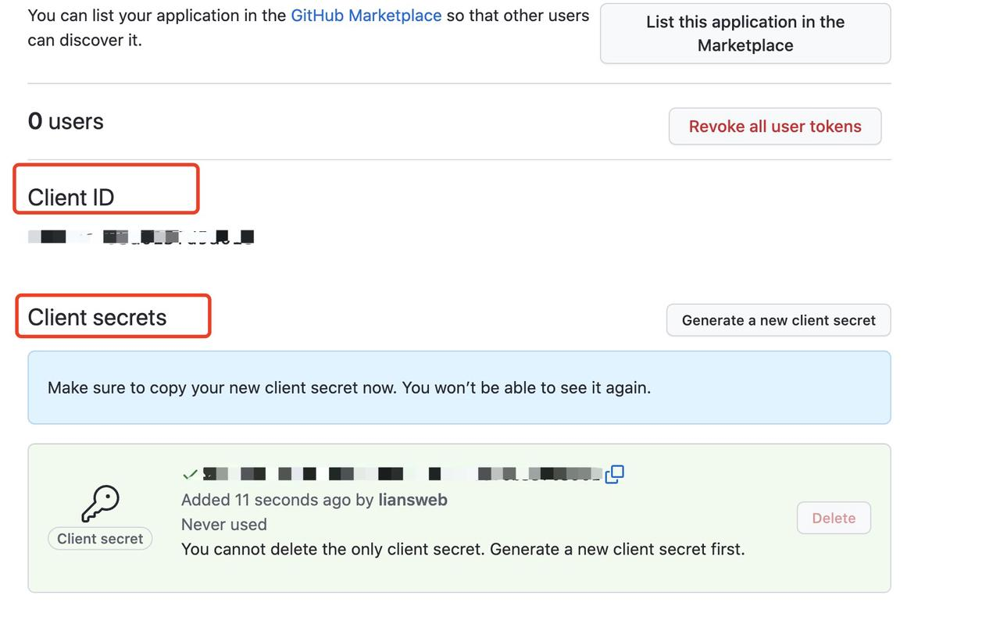
在gitlab的配置文件中开启Oauth 认证，我们cd 到 /config/gitlab.rb  然后去追加一些代码。
将刚刚获取创建到的 app_id  app_secret  添加上。

    ### OmniAuth Settings
    ###! Docs: https://docs.gitlab.com/ee/integration/omniauth.html
    gitlab_rails['omniauth_allow_single_sign_on'] = ['github']
    gitlab_rails['omniauth_auto_link_ldap_user'] = true
    gitlab_rails['omniauth_block_auto_created_users'] = true
    gitlab_rails['omniauth_providers'] = [
    {
    name: "github",
    app_id: "APP_IP", 
    app_secret: "APP_SECRET",
    args: { scope: "user:email" }
    }
    ]

访问本地 8080端口、到此环境已经搭建成功。

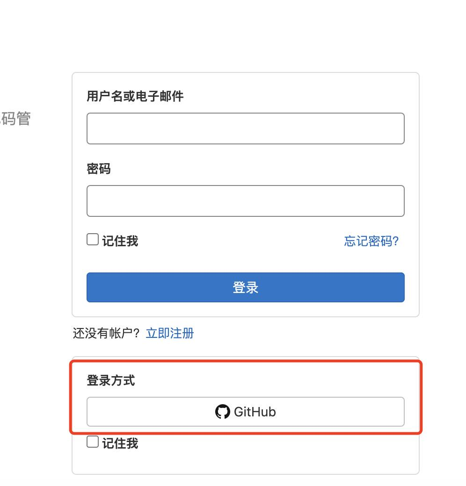

# 漏洞复现
## 漏洞原理

Github OAuth app 采用了OAuth2。 在我们认识漏洞之前，先简单了解一下 OAuth2。

### 传统的身份验证模型：
 在传统的客户端-服务器身份验证模型中，客户端通过使用资源所有者的凭据向服务器进行身份验证来请求服务器上的访问受限制的资源（受保护的资源）。为了向第三方应用程序提供对受限资源的访问权限，资源所有者与第三方共享其凭据。

### 传统的身份验证模型中会存在哪些问题和限制呢？

- 第三方应用程序会以明文的形式存储存储资源所有者的凭据。
- 任何第三方应用程序的泄露都会导致最终用户的密码以及受该密码保护的所有数据受损。
还有别的问题和限制。感兴趣的朋友可以去了解一下 [rfc6749](http://www.rfcreader.com/#rfc6749)。

### OAuth2是如何解决的呢？
OAuth2 通过引入授权层并将客户端的角色与资源所有者的角色分开来解决这些问题。在 OAuth2 中，客户端请求访问由资源所有者控制并由资源服务器托管的资源，并向其颁发一组与资源所有者不同的凭据。客户端获取访问令牌（表示特定作用域、生存期和其他访问属性的字符串），而不是使用资源所有者的凭据来访问受保护的资源。访问令牌由授权服务器在资源所有者的批准下颁发给第三方客户端。客户端使用访问令牌访问资源服务器承载的受保护资源。）

### OAuth2数据流程？
    （A）用户打开客户端以后，客户端要求用户给予授权。
    （B）用户同意给予客户端授权。
    （C）客户端使用上一步获得的授权，向认证服务器申请令牌。
    （D）认证服务器对客户端进行认证以后，确认无误，同意发放令牌。
    （E）客户端使用令牌，向资源服务器申请获取资源。
    （F）资源服务器确认令牌无误，同意向客户端开放资源。
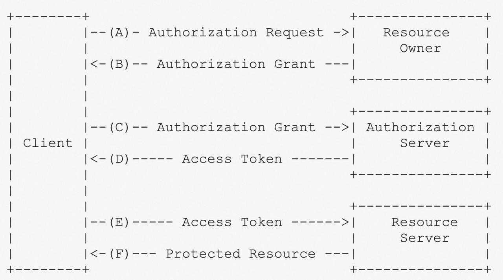

### Github中 OAuth web授权流程      
A、用户被重定向，以请求他们的 GitHub 身份
B、用户被 GitHub 重定向回您的站点
C、您的应用程序使用用户的访问令牌访问 API

看下Gitlab  Diff 记录， password.rb 中  定义了默认密码。当使用第三方登录的时候，会自动创建与github同名的账户，默认密码 为 123qweQWE!@#000000000 

我们在Gitlab登陆页，选择登陆方式为GitHub时：

1、Gitlab会向 http://127.0.0.1:8080/users/auth/github 发起POST请求。

2、http://127.0.0.1:8080/users/auth/github 会重定向到https://github.com/login/oauth/authorize?发起GET请求，携带的参数如下。

    client_id :       在gitlab.rb 中填写的app_id
    redirect_uri:     授权后重定向到项目的地址，必须和Github OAuth App时的callback url相同
    response_type:    表示授权类型，此处的值固定为"code"
    Scope: user:email 希望得到的权限范围.
    state:            不可猜测的随机字符串。它用于防止跨站点请求伪造攻击。
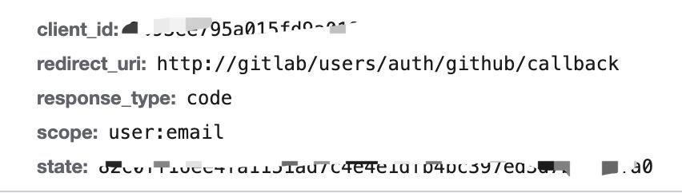

3、Gitlab发起的 redirect_uri 与在GitHub中填写的callback中不相同时。报了错。

    我们在Github填写的Callback 为  http://127.0.0.1:8080/users/auth/github/callback

    此时的redirect_uri为。http://gitlab/users/auth/github/callback

在我去想着如何修改 redirect_uri ，做了很多尝试没有用。

4、没有办法的办法下、因为redirect_uri 与callback不同、然后我尝试将Github 的  Callback修改为redirect_uri，将redirect_url ( http://gitlab/users/auth/github/callback) 填到 Callback 看起来太荒谬了。怎么会有这种url。

5、没什么办法，只能先试试吧。先将 Github 的Callback修改为http://gitlab/users/auth/github/callback做尝试。
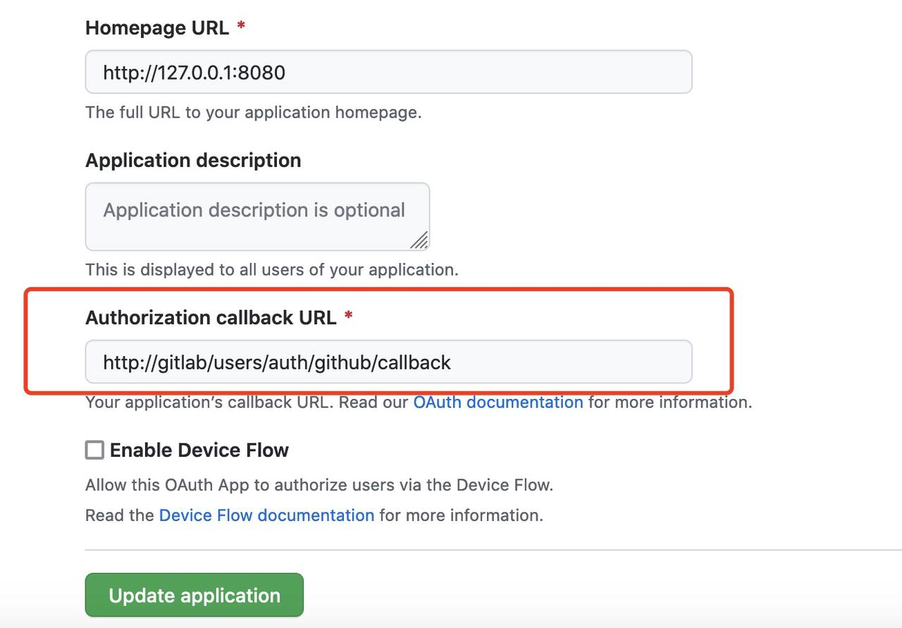
6、回到gitlab登陆页，点击GitHub登陆、跳转到授权页面。红框标注的是认证后将会跳转到 http://gitlab ,这肯定不对。先往下走吧。再看看这次请求的参数。
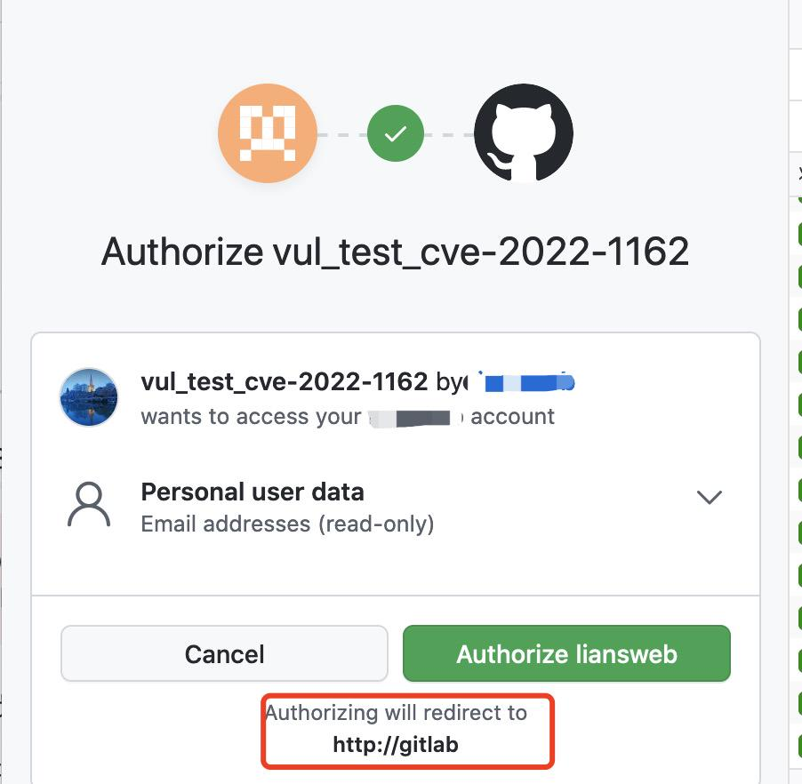
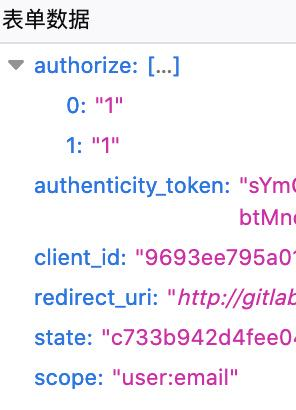

7、最后会向GitHub中填写的Callback跳转 发起GET请求参数为  http://gitlab/users/auth/github/callback?code=xxxxxxx&state=xxxxxxxx,碰到了糟糕的502。但是，有的好消息是、他有code参数和state参数。
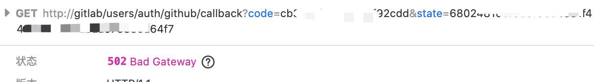

8、当我再翻看OAuth2 的数据流程时，我注意到在第六步时会将 Access Token 发送到Resource Server ，只要将这个请求发到http://127.0.0.1:8080/users/auth/github/callback ,就已经接近完成了。既然GitHub不能自己跳转、我尝试能不能自己去修改。
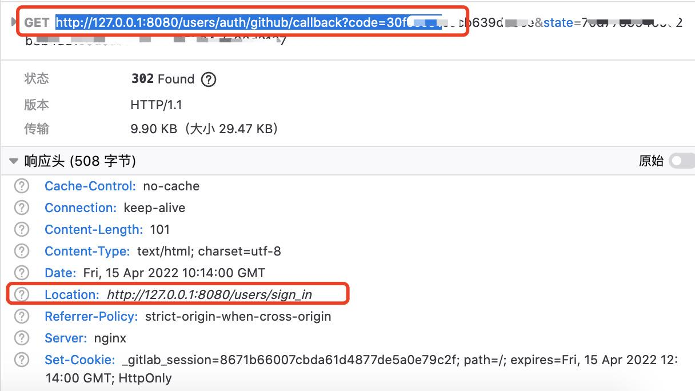

9、将gitlab 修改为 http://127.0.0.1:8080 ,然后又被跳转到登陆页。出现了以下错误，
您的帐户正在等待您的GitLab管理员的批准，因此被阻止。如果您认为这是一个错误，请联系您的GitLab管理员
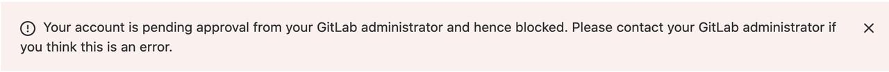
登陆root账号查看，存在一个没有激活的账户。
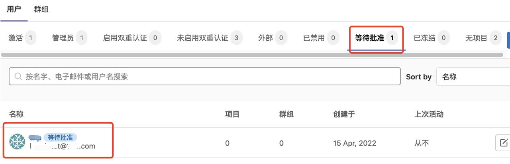

最后利用管理员权限、将用户激活、测试。

    注意注册的用户 账户名是 GitHub用户名、
    密码就是123qweQWE!@#000000000 
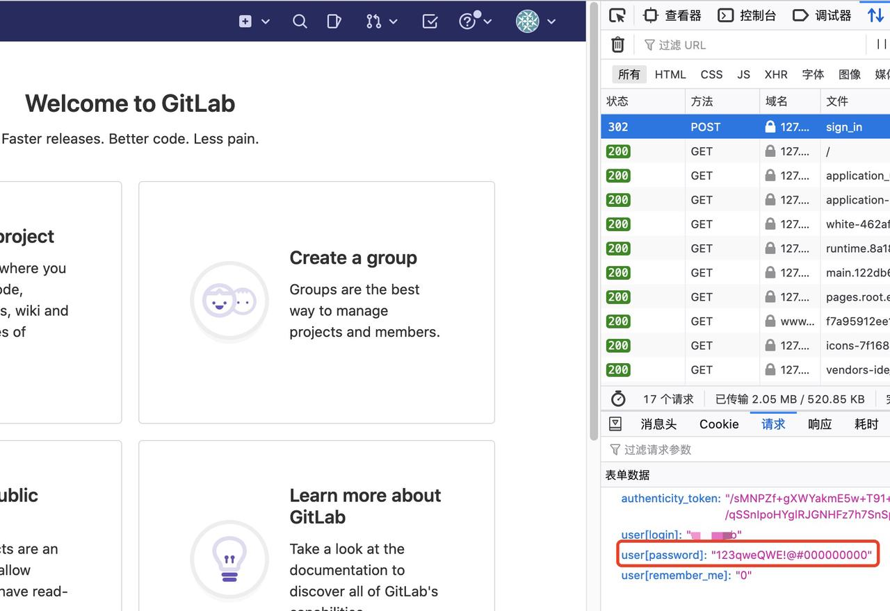

 # 修复建议
 目前官方已经对该漏洞进行了修复，在做好数据备份之后升级到安全版本。
# 参考材料
https://about.gitlab.com/releases/2022/03/31/critical-security-release-gitlab-14-9-2-released/?fbclid=IwAR0yf94g69dMEKraW-g7SCnfEXlgVrj6dKgpFxoWzonpmwHeaxTrK8l3by8

https://about.gitlab.com/releases/2022/03/31/critical-security-release-gitlab-14-9-2-released/?fbclid=IwAR0yf94g69dMEKraW-g7SCnfEXlgVrj6dKgpFxoWzonpmwHeaxTrK8l3by8critical-security-release-gitlab-14-9-2-released/?fbclid=IwAR0yf94g69dMEKraW-g7SCnfEXlgVrj6dKgpFxoWzonpmwHeaxTrK8l3by8

https://docs.github.com/cn/developers/apps/building-oauth-apps/authorizing-oauth-apps

http://www.ruanyifeng.com/blog/2014/05/oauth_2_0.html